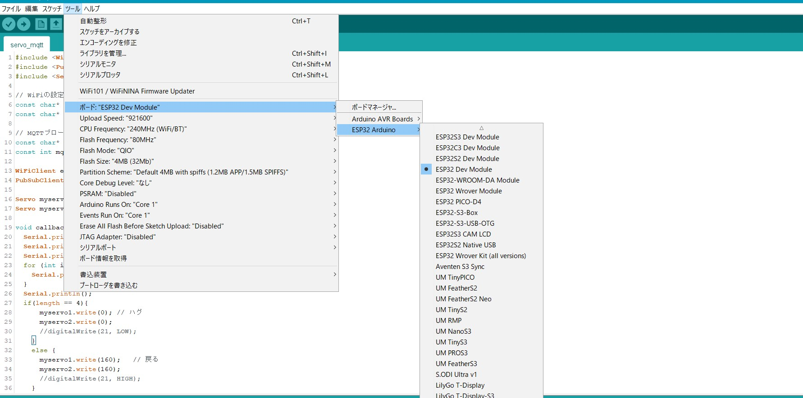

# 説明書　　
- 腕
  - Pythonの実行ボタンを押したら、腕が動くようになる。
  - 1回押すと、自動で戻る。
  - モバイルバッテリー(短いほう)と電源(長いほう)を入れてから、腕を動かす。
  - Pythonプログラムの内容
  - 文字数が4文字だったら腕が動く
  - 文字数が3文字だったら腕が動かない
  - 毎回押さないと動かないので注意する
  - wifiの書き換えが必要
  - コードhttps://github.com/sakashita100/heart/blob/main/arm/servo.c
  - ESP32のダウンロードも必要になる
  - ↓ESP32のモジュールの接続の仕方
  -  

- 心拍数
  - 心拍数を聞くことが出来る　https://sakashita100.github.io/heart/
  - https://github.com/sakashita100/heart/blob/main/js/heartbeat.js
  - に書かれたvar dataの値を変えると心拍数も変えることが出来る
